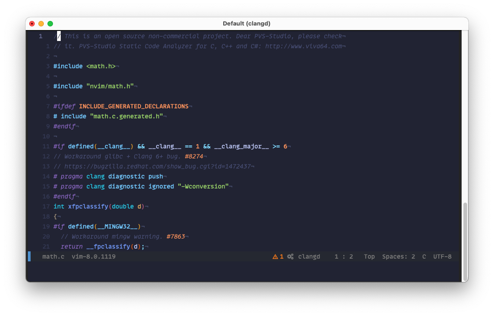

# unified-dotfiles
My unified dotfiles from Gentoo and macOS

# Softwares used on macOS

- Homebrew
- Exa
- ripgrep
- Google Chrome
- Docker for Mac
- Fantastical 2
- VSCode
- Spotify
- iTerm 2
- Telegram

# Softwares used on Gentoo

- lz4
- neovim
- pip
- git
- zsh
- Exa
- ripgrep
- fontawesome
- jetbrains-mono
- noto-emoji
- roboto
- pulsemixer
- mpv
- telegram-desktop
- nodejs
- dhcpcd
- wpa_supplicant
- parted
- gcc
- intel-microcode
- dosfstools
- libfat
- gentoo-sources
- linux-firmware
- rust
- firefox
- alacritty

## Sway
- bemenu
- grim
- slurp
- waybar
- wl-clipboard
- sway

## Vim plugins

- MatchTag
- alchemist
- ale
- coc
- commentary
- css3-syntax
- cute-python
- delimitMate
- devicons
- easy-align
- editorconfig
- emmet-vim
- fountain
- fzf
- goyo
- html5
- json
- limelight
- mix-format
- nerdtree
- polyglot
- pomodoro
- prettier
- rainbow
- signature
- sneak
- surround
- tagbar
- terraform
- vim-coc
- vim-commentary
- vim-devicons
- vim-json
- vim-prettier
- vim-surround
- vimwiki

## Coc Plugins

- coc-snippets
- coc-rls
- coc-tsserver
- coc-eslint
- coc-tslint-plugin
- coc-prettier
- coc-json
